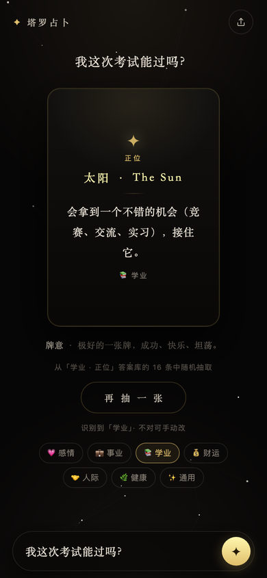

# paula1 — Ask Oracle

🔮 一个「提问 → 得到回答」的移动端应用。**按 Figma 设计稿 1:1 还原为网页**，并接上了真实可用的问答逻辑。

## 在线使用

👉 **https://paulachen007.github.io/paula1/**


<sub>手机扫码直接打开</sub>



## 装到 iPhone 主屏幕，就是一个 App

这是 PWA，**不用上架 App Store、不用装任何东西**：

1. 用 **Safari** 打开 https://paulachen007.github.io/paula1/
2. 点底部中间的 **分享** 按钮
3. 选 **「添加到主屏幕」** → 命名 → 添加
4. 回到桌面，点新出现的图标即可

装好之后：

| 特性 | 说明 |
|:--|:--|
| 独立图标 | 桌面图标，不是 Safari 书签 |
| 全屏运行 | 没有地址栏和浏览器工具栏 |
| **启动画面** | 打开时显示金色星标启动图（9 种 iPhone 尺寸精确适配），不再闪白屏 |
| **断网可用** | Service Worker 缓存全部资源，飞行模式也能打开 |
| 无回弹 / 无缩放 | 关掉了 iOS 的下拉橡皮筋和双击缩放，手感接近原生 |
| 适配刘海 | 使用 `safe-area-inset`，内容不会被灵动岛或 Home 指示条遮住 |

> 说明：设计稿里的状态栏（9:41 / 信号 / 电池）和底部 Home 指示条**没有画进页面** —— 那是 iOS 系统界面，全屏运行时系统会自己绘制，再画一遍会重影。

## 设计还原来源

Figma 文件 `test-问答`（3 个 428×926 画板，实际为 2 个页面）。

设计规范是从 Figma API 直接读取的，不是靠肉眼估：

| 项 | 值（来自设计稿） |
|:--|:--|
| 字体 | **Almendra**（400 / 700 / 400 italic，已自托管） |
| 主文字 | `#E3E1DB` |
| 次级文字 / 卡片文字 | `#D0C7B8` |
| 金色小字与高亮 | `#AC8D56` |
| 主标题 | Almendra 36px w700 / 行高 46.656 |
| 卡片文字 | Almendra 24px w400 / 行高 31.104 |
| 答案卡片 | 224×383，圆角 15，描边 `#E3E1DB` 3px，竖向渐变 `#221E1E → #7E6D6D` |
| 输入条 | 353×46，圆角 23，填充 `#D0CCC9` @67%，描边 `#D0C7B8` 1px |
| 顶部圆按钮 | 44×44，奶油底 `#D0C7B8` + 深色图标 |
| 画板 | 428×926（等比缩放到各种机型） |

**实现方式**：页面按设计稿 428×926 的坐标绝对定位，再用 `transform: scale()` 等比缩放到当前机型（`scale = min(视口宽/428, 可用高/926)`），并扣除 `safe-area-inset`。所以任何屏幕比例下，版面都和设计稿完全一致。

## 两个页面

| 页面 | 内容 |
|:--|:--|
| **输入页** | 问候语、副标题、底部输入条（麦克风 + 键盘图标） |
| **解答页** | 问题、答案卡片、`View similar case` 按钮、底部输入条 |

交互映射：

- 输入问题 + 回车 / 点麦克风 → 跳到解答页
- **`View similar case`** → 同一问题再抽一条答案
- **主页按钮** → 回到输入页
- **麦克风** → 调用浏览器语音识别（不支持的浏览器会退回聚焦输入框）
- **分享按钮** → 系统分享面板，不支持时复制链接

## 答案逻辑

接入了 7 个话题的英文答案库：

| 话题 | 正位库 | 逆位库 | 关键词 |
|:--|--:|--:|--:|
| 💗 Love | 10 | 10 | 30 |
| 💼 Work | 10 | 10 | 33 |
| 📚 Study | 10 | 10 | 31 |
| 💰 Money | 10 | 10 | 33 |
| 🤝 People | 10 | 10 | 31 |
| 🌿 Health | 10 | 10 | 33 |
| ✨ General | 10 | 10 | 回退 |
| **合计** | | | **140 条** |

- **话题识别**：关键词计分匹配，长关键词权重更高；识别不出时回退 `General`。实测 14 条常见英文问题 **14/14 正确**
- **金色高亮**：答案里用 `{...}` 标记关键短语，渲染时转成金色 `<em>`（140 条全部已标记）

## 技术说明

- **单页应用**：`index.html` + `answers.js`，无框架、无构建步骤
- **零 CDN**：字体、图片全部自托管，**断网可用**
- **PWA**：`manifest.json` + `sw.js` 离线缓存，可「添加到主屏幕」全屏运行
- **无追踪**：没有统计、广告或第三方脚本

## 文件结构

```
index.html      # 两个页面 + 全部样式与逻辑
answers.js      # 话题关键词 + 140 条英文答案库 + 识别函数
manifest.json   # PWA 清单
sw.js           # Service Worker 离线缓存
assets/         # 背景、人像、图标、玻璃按钮素材（WebP/SVG）
fonts/          # Almendra 字体（woff2，自托管）
icons/          # 应用图标（192/512/maskable/apple-touch/favicon）
preview.png     # 界面预览
qr.png          # 在线地址二维码
classic.html    # 上一版（中文塔罗）留档
```

## 本地运行

```bash
git clone https://github.com/paulachen007/paula1.git
cd paula1
python3 -m http.server 8000
# 打开 http://localhost:8000
```

> Service Worker 需要 HTTPS 或 localhost 才生效；直接双击 `index.html` 时页面正常但离线缓存不可用。

---

仅供娱乐 · 命运始终在你手里
